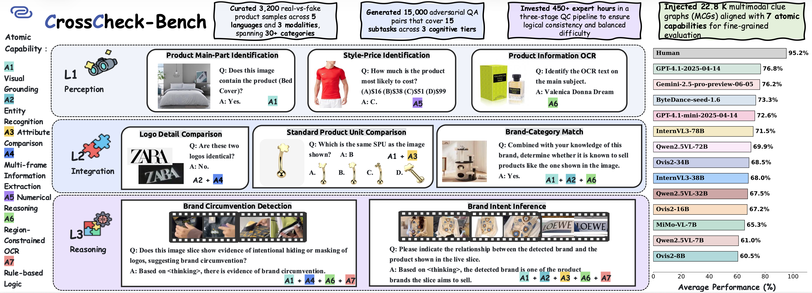
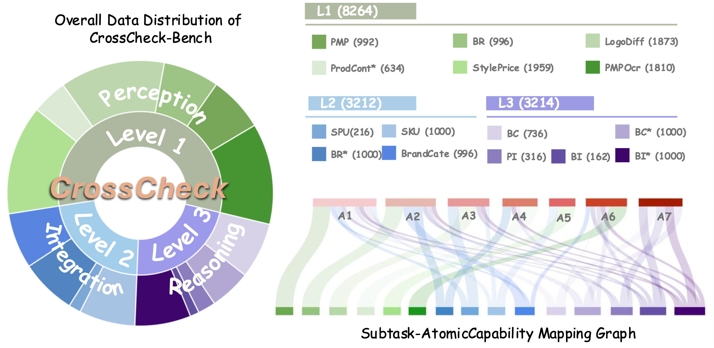
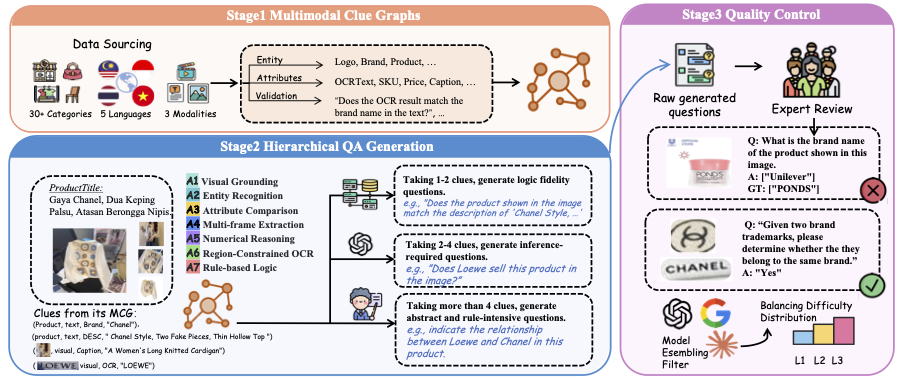

<h1 align="center" style="line-height: 50px;">
  CrossCheck-Bench: Diagnosing Compositional Failures 
  in Multimodal Conflict Resolution
</h1>

<div align="center">

Baoliang Tian<sup>1*</sup>, Yuxuan Si<sup>1,2*</sup>, Jilong Wang<sup>1,3*</sup>,  Lingyao Li<sup>1</sup>, Zhongyuan Bao<sup>1</sup>, Zineng Zhou<sup>1</sup>,  
Tao Wang<sup>1†</sup>,  Sixu Li<sup>1</sup>, Ziyao Xu<sup>1</sup>, Mingze Wang<sup>1</sup>, Zhouzhuo Zhang<sup>1</sup>, Zhihao Wang<sup>1</sup>,  
Yike Yun<sup>1</sup>, Ke Tian<sup>1</sup>, Ning Yang<sup>3†</sup>, Minghui Qiu<sup>1</sup>  

<br>

<sup>1</sup>ByteDance  <sup>2</sup>Zhejiang University  <sup>3</sup>Institute of Automation, Chinese Academy of Sciences  <small>*Equal Contribution</small>

<br>

[](https://github.com/bytedance/CrossCheck-Bench)
[](https://github.com/bytedance/CrossCheck-Bench)
[](https://github.com/bytedance/CrossCheck-Bench)
[](https://github.com/bytedance/CrossCheck-Bench)

<h3 style="color: #d32f2f; font-weight: bold;">AAAI 2026 (Oral)</h3>
</div>

---

## 🚀 Introduction


<p align="left">
  <b style="color: #2f60d3ff; font-size:18px;">🔥 We will open-source the full CrossCheck-Bench dataset, benchmark suite, and evaluation toolkit. Stay tuned!</b>
</p>


<p align="center">
  
</p>

Multimodal Large Language Models (MLLMs) demonstrate impressive reasoning and perception ability. However, their **compositional robustness under conflicting multimodal signals** remains underexplored. Real-world scenarios frequently present contradictions between text and images, requiring models to choose the correct modality or resolve inconsistencies.

**CrossCheck-Bench** is introduced to systematically diagnose **compositional failures** in MLLMs under multimodal conflicts. The benchmark consists of:

- **Structured multimodal conflict categories**  
- **Compositional reasoning tasks under contradictory cues**  
- **Human-verified conflict annotations**  
- **Robust evaluation protocol and metrics**

Our experiments reveal significant failure modes across state-of-the-art MLLMs, including:
- Over-reliance on textual cues  
- Incorrect visual grounding  
- Multi-hop reasoning breakdowns  
- Failure on conflict-sensitive attributes  

CrossCheck-Bench provides the first comprehensive diagnostic tool for understanding these weaknesses.

---

## 📊 Benchmark Details

### 📝 Dataset Overview

<p align="center">
  
</p>


CrossCheck-Bench includes **diverse multimodal conflict scenarios**, covering:

- Attribute conflict  
- Logical inconsistencies  
- Text vs. image contradiction  
- Spatial and relational conflicts  
- Multi-entity compositional conflict  
- Instruction override conflict  

Each sample contains:
- A conflicting multimodal input (image + text)
- Metadata on the conflict type
- Ground-truth resolution label
- Reasoning trace (optional)

---

## 🔧 Construction Pipeline

### ✨ Pipeline

<p align="center">
  
</p>

The benchmark is constructed via a multi-stage pipeline:

1. **Template-based conflict generation**  
2. **LLM-assisted conflict mutation**  
3. **Human verification**  
4. **Consistency filtering**  
5. **Compositional augmentation**  

---

## 🛠️ Usage
<p align="left">
  <b style="color: #2f60d3ff; font-size:18px;">🔥 Code is coming soon. Stay tuned!</b>
</p>


<!-- ### 1️⃣ Install Environment

```bash
conda create -n crosscheck python=3.10
conda activate crosscheck
pip install -r requirements.txt
```

### 2️⃣ Download Dataset

```bash
huggingface-cli download comingsoon! \
    --repo-type dataset \
    --local-dir ./data \
    --local-dir-use-symlinks False
```


### 3️⃣ Load Dataset

```bash
from datasets import load_dataset

dataset = load_dataset("comingsoon!")
print(dataset["validation"][0])
```


### 4️⃣ Run Evaluation

```bash
python eval.py \
    --model qwen3-vl \
    --data ./data \
    --output results.json
``` -->
